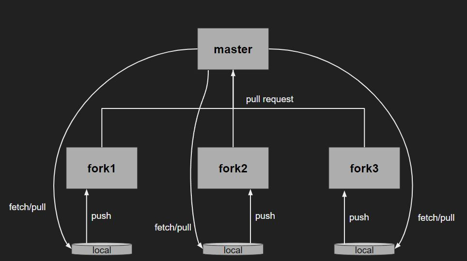

# week 1

1주차 과제들

1. [팀 워크플로우 이해하기](#1-팀-워크플로우-이해하기)
2. [나라를 기준으로 샘플을 나눈 데이터 정리 문제](#2-나라를-기준으로-샘플을-나눈-데이터-정리-문제)
3. [배운 내용](#3-배운-내용)

 

## 1. 팀 워크플로우 이해하기

깃허브를 이용해서 버전관리를 한다. 이 때 팀의 원격 저장소와 개인 원격저장소 간의 관계를 이해하고 어떻게 워크플로우가 동작하는지 이해한다.

 

### 깃허브 repo 워크플로우 이해하기

1. 팀원 들은 모두 master repository를 fork해서 자기만의 원격 저장소를 만든다.
2. 각자 만든 원격 저장소를 로컬 저장소를 clone 또는 pull해온다.
3. 로컬 저장소에서 작업을 한 후에 개인 원격저장소에 push한다. **push하기 전엔 upstream(master) 저장소로부터 fetch또는 pull을 해서 master branch와 conflict가 발생하진 않는지 등을 점검한다.**
4. 개인 원격저장소가 업데이트 되었으면 master 저장소로 pull request를 보낸다.

 
 

## 2. 나라를 기준으로 샘플을 나눈 데이터 정리 문제

주로 pandas의 DataFrame을 다루는데 많은 연습을 한다.

 
 

## 3. 배운 내용

1. 깃과 깃허브를 이용한 팀 워크플로우
2. pandas의 DataFrame 사용법
3. 결측치 처리하는 법
4. 특정 패턴의 데이터를 원하는 데로 처리하기
5. 같은 feature를 공유하는 두개의 Dataframe을 합치기